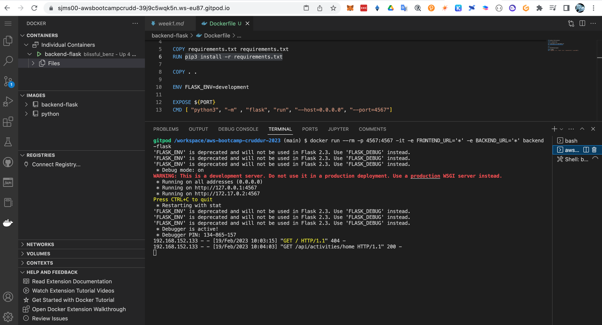
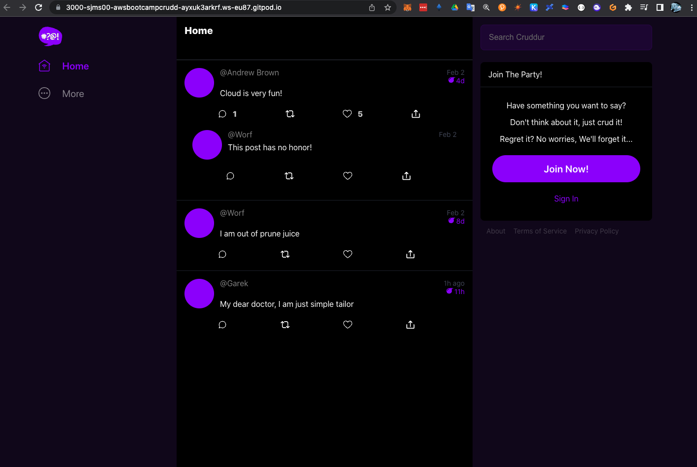
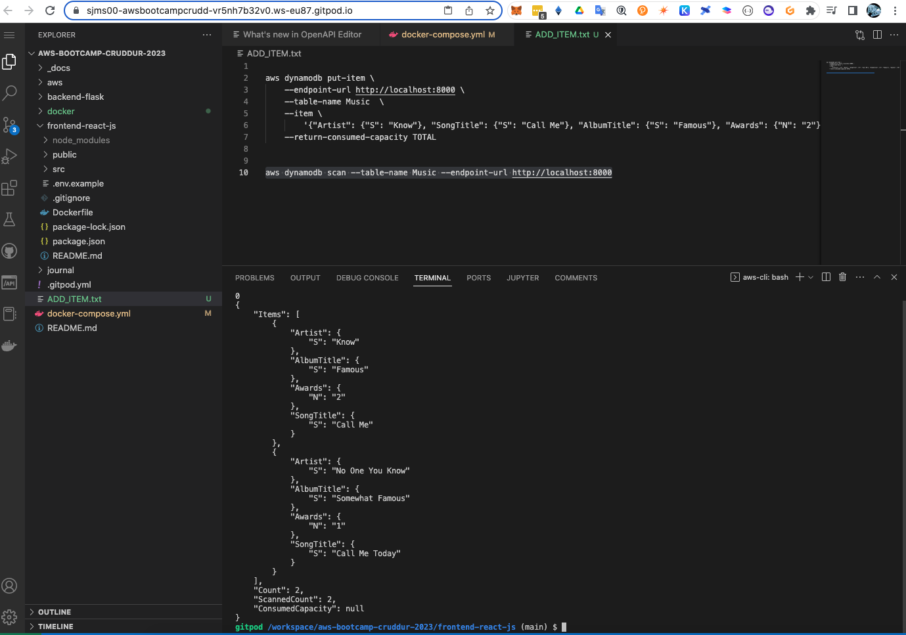
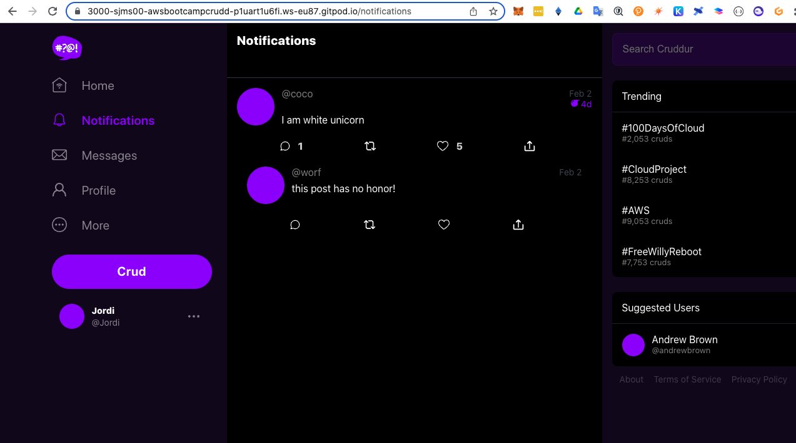
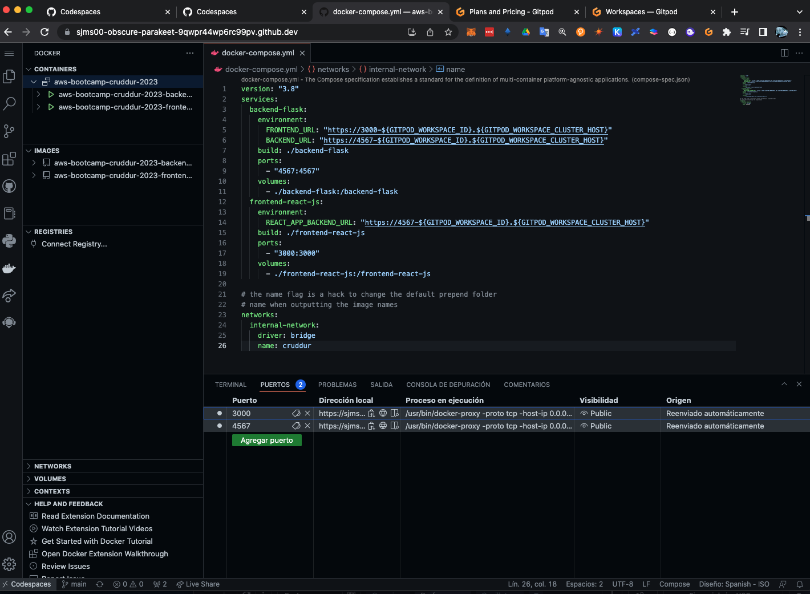
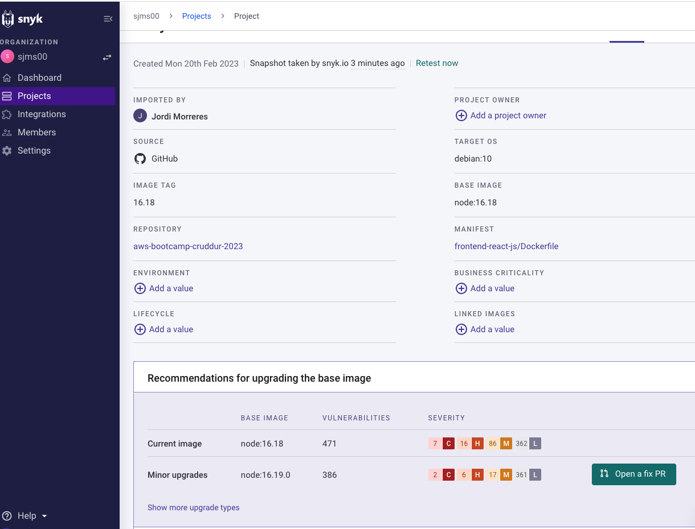
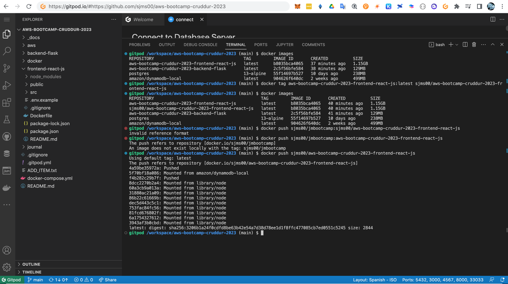
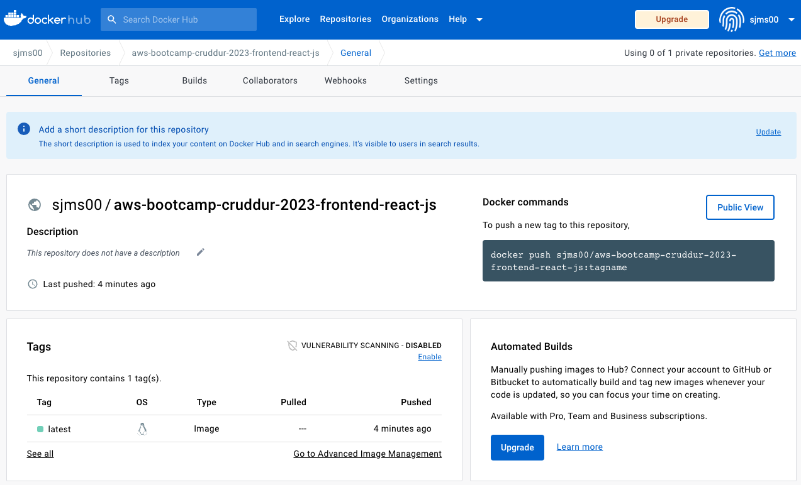
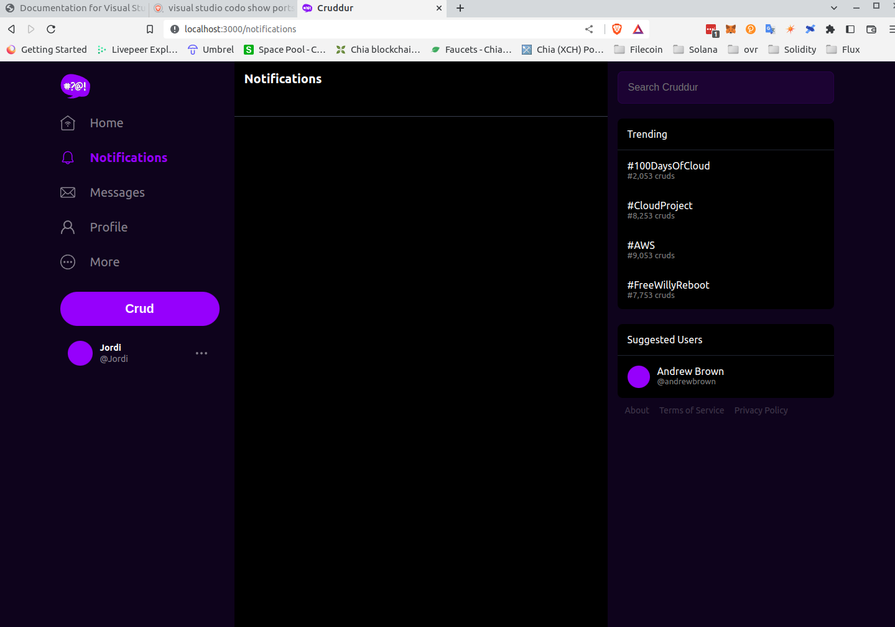

# Week 1 — App Containerization

## References

Good Article for Debugging Connection Refused
https://pythonspeed.com/articles/docker-connection-refused/


## VSCode Docker Extension

Docker for VSCode makes it easy to work with Docker

https://code.visualstudio.com/docs/containers/overview

> Gitpod is preinstalled with theis extension

## Containerize Backend

### Run Python

```sh
cd backend-flask
export FRONTEND_URL="*"
export BACKEND_URL="*"
python3 -m flask run --host=0.0.0.0 --port=4567
cd ..
```

- make sure to unlock the port on the port tab
- open the link for 4567 in your browser
- append to the url to `/api/activities/home`

I get back this json:

 


### Add Dockerfile

Create a file here: `backend-flask/Dockerfile`

```dockerfile
FROM python:3.10-slim-buster

WORKDIR /backend-flask

COPY requirements.txt requirements.txt
RUN pip3 install -r requirements.txt

COPY . .

ENV FLASK_ENV=development

EXPOSE ${PORT}
CMD [ "python3", "-m" , "flask", "run", "--host=0.0.0.0", "--port=4567"]
```

### Build Container

```sh
docker build -t  backend-flask ./backend-flask
```

### Run Container

Run 
```sh
docker run --rm -p 4567:4567 -it -e FRONTEND_URL='*' -e BACKEND_URL='*' backend-flask
```

Run in background
```sh
docker container run --rm -p 4567:4567 -d backend-flask
```

Return the container id into an Env Var
```sh
CONTAINER_ID=$(docker run --rm -p 4567:4567 -d backend-flask)
```

> docker container run is idiomatic, docker run is legacy syntax but is commonly used.

### Get Container Images or Running Container Ids

```
docker ps
docker images
```
my docker started:



### Send Curl to Test Server

```sh
curl -X GET http://localhost:4567/api/activities/home -H "Accept: application/json" -H "Content-Type: application/json"
```
That's work:


### Check Container Logs

```sh
docker logs $CONTAINER_ID -f
docker logs backend-flask -f
docker logs $CONTAINER_ID -f
```

###  Debugging  adjacent containers with other containers

```sh
docker run --rm -it curlimages/curl "-X GET http://localhost:4567/api/activities/home -H \"Accept: application/json\" -H \"Content-Type: application/json\""
```

busybosy is often used for debugging since it install a bunch of thing

```sh
docker run --rm -it busybosy
```

### Gain Access to a Container

```sh
docker exec $CONTAINER_ID -it /bin/bash
```

> You can just right click a container and see logs in VSCode with Docker extension

### Delete an Image

```sh
docker image rm backend-flask --force
```

> docker rmi backend-flask is the legacy syntax, you might see this is old docker tutorials and articles.

> There are some cases where you need to use the --force

### Overriding Ports

```sh
FLASK_ENV=production PORT=8080 docker run -p 4567:4567 -it backend-flask
```

> Look at Dockerfile to see how ${PORT} is interpolated

## Containerize Frontend

## Run NPM Install

We have to run NPM Install before building the container since it needs to copy the contents of node_modules

```
cd frontend-react-js
npm i
```

### Create Docker File

Create a file here: `frontend-react-js/Dockerfile`

```dockerfile
FROM node:16.18

ENV PORT=3000

COPY . /frontend-react-js
WORKDIR /frontend-react-js
RUN npm install
EXPOSE ${PORT}
CMD ["npm", "start"]
```

### Build Container

```sh
docker build -t frontend-react-js ./frontend-react-js
```

### Run Container

```sh
docker run -p 3000:3000 -d frontend-react-js
```

## Multiple Containers

### Create a docker-compose file

Create `docker-compose.yml` at the root of your project.

```yaml
version: "3.8"
services:
  backend-flask:
    environment:
      FRONTEND_URL: "https://3000-${GITPOD_WORKSPACE_ID}.${GITPOD_WORKSPACE_CLUSTER_HOST}"
      BACKEND_URL: "https://4567-${GITPOD_WORKSPACE_ID}.${GITPOD_WORKSPACE_CLUSTER_HOST}"
    build: ./backend-flask
    ports:
      - "4567:4567"
    volumes:
      - ./backend-flask:/backend-flask
  frontend-react-js:
    environment:
      REACT_APP_BACKEND_URL: "https://4567-${GITPOD_WORKSPACE_ID}.${GITPOD_WORKSPACE_CLUSTER_HOST}"
    build: ./frontend-react-js
    ports:
      - "3000:3000"
    volumes:
      - ./frontend-react-js:/frontend-react-js

# the name flag is a hack to change the default prepend folder
# name when outputting the image names
networks: 
  internal-network:
    driver: bridge
    name: cruddur
```

I run 'docker compose up' and I'll test that the app is working:



## Adding DynamoDB Local and Postgres

We are going to use Postgres and DynamoDB local in future labs
We can bring them in as containers and reference them externally

Lets integrate the following into our existing docker compose file:

### Postgres

```yaml
services:
  db:
    image: postgres:13-alpine
    restart: always
    environment:
      - POSTGRES_USER=postgres
      - POSTGRES_PASSWORD=password
    ports:
      - '5432:5432'
    volumes: 
      - db:/var/lib/postgresql/data
volumes:
  db:
    driver: local
```

To install the postgres client into Gitpod

```sh
  - name: postgres
    init: |
      curl -fsSL https://www.postgresql.org/media/keys/ACCC4CF8.asc|sudo gpg --dearmor -o /etc/apt/trusted.gpg.d/postgresql.gpg
      echo "deb http://apt.postgresql.org/pub/repos/apt/ `lsb_release -cs`-pgdg main" |sudo tee  /etc/apt/sources.list.d/pgdg.list
      sudo apt update
      sudo apt install -y postgresql-client-13 libpq-dev
```

### DynamoDB Local

```yaml
services:
  dynamodb-local:
    # https://stackoverflow.com/questions/67533058/persist-local-dynamodb-data-in-volumes-lack-permission-unable-to-open-databa
    # We needed to add user:root to get this working.
    user: root
    command: "-jar DynamoDBLocal.jar -sharedDb -dbPath ./data"
    image: "amazon/dynamodb-local:latest"
    container_name: dynamodb-local
    ports:
      - "8000:8000"
    volumes:
      - "./docker/dynamodb:/home/dynamodblocal/data"
    working_dir: /home/dynamodblocal
```

## Volumes

directory volume mapping

```yaml
volumes: 
- "./docker/dynamodb:/home/dynamodblocal/data"
```

named volume mapping

```yaml
volumes: 
  - db:/var/lib/postgresql/data

volumes:
  db:
    driver: local
```

Example of using DynamoDB local
https://github.com/100DaysOfCloud/challenge-dynamodb-local

I created a table in dynamodb and add items to test, and it works:



And the postgres connection works fine also:
Run `psql -Upostgres --host localhost`


## Improve the code, addind notification feature
I added the notification feature in backend and frontend containers:



## Testing tools

### gidhub codespaces
I tested to use the gidhub codespaces


### Snyk
I tested Snyk to find vulnerabilities in our frontend code, I find it because we use an old node version



Entire repo:


# Homework Challenges    
## Run the dockerfile CMD as an external script

## Push and tag a image to DockerHub (they have a free tier)

I tag an image with my account in dockerhub and then push it:
```sh
docker tag aws-bootcamp-cruddur-2023-frontend-react-js:latest sjms00/aws-bootcamp-cruddur-2023-frontend-react-js
docker push sjms00/aws-bootcamp-cruddur-2023-frontend-react-js
```


In dockerhub we see the image uploaded:



## Use multi-stage building for a Dockerfile build

## Implement a healthcheck in the V3 Docker compose file

## Research best practices of Dockerfiles and attempt to implement it in your Dockerfile

## Learn how to install Docker on your localmachine and get the same containers running outside of Gitpod / Codespaces

I used my Visual Studio Code on Ubuntu, and install/configured docker to run the four containers
I used this link to install Docker:
https://docs.docker.com/engine/install/ubuntu/

I added the extensions for Explore Databases in my Visual Studio
I installed manually the postgres soft:
```sh
      curl -fsSL https://www.postgresql.org/media/keys/ACCC4CF8.asc|sudo gpg --dearmor -o /etc/apt/trusted.gpg.d/postgresql.gpg
      echo "deb http://apt.postgresql.org/pub/repos/apt/ `lsb_release -cs`-pgdg main" |sudo tee  /etc/apt/sources.list.d/pgdg.list
      sudo apt update
      sudo apt install -y postgresql-client-13 libpq-dev
```

And this is the result:




## Launch an EC2 instance that has docker installed, and pull a container to demonstrate you can run your own docker processes. 
