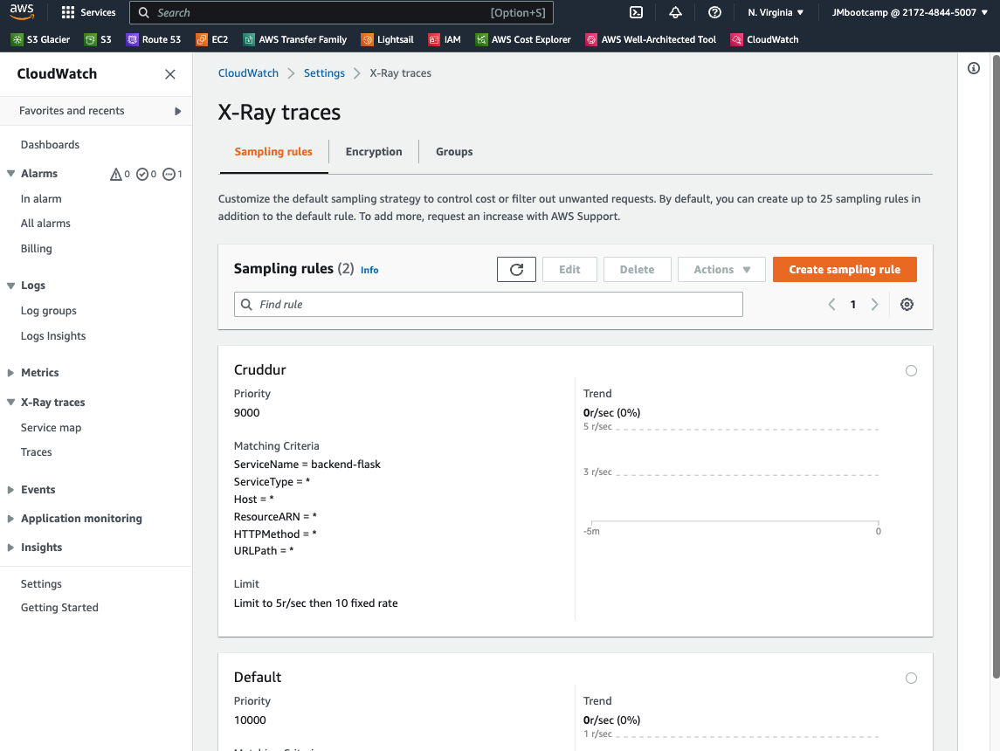

# Week 2 — Distributed Tracing

## X-Ray

I'm used this doc:
https://boto3.amazonaws.com/v1/documentation/api/latest/reference/services/xray.html
https://github.com/aws/aws-xray-sdk-python

### Instrument AWS X-Ray for Flask

We need to define this variables in the shell and gitpod config:

```sh
export AWS_REGION="us-east-1"
gp env AWS_REGION="us-east-1"
```

Add to the `requirements.txt`

```py
aws-xray-sdk
```

Install python dependencies

```sh
pip install -r requirements.txt
```

Add to `app.py`

```py
from aws_xray_sdk.core import xray_recorder
from aws_xray_sdk.ext.flask.middleware import XRayMiddleware

......

xray_url = os.getenv("AWS_XRAY_URL")
xray_recorder.configure(service='backend-flask', dynamic_naming=xray_url)

.....

app = Flask(__name__)  # already exists
# X-Ray ---------
XRayMiddleware(app, xray_recorder)
```

### Setup AWS X-Ray Resources

Add `aws/json/xray.json`

```json
{
    "SamplingRule": {
        "RuleName": "Cruddur",
        "ResourceARN": "*",
        "Priority": 9000,
        "FixedRate": 0.1,
        "ReservoirSize": 5,
        "ServiceName": "backend-flask",
        "ServiceType": "*",
        "Host": "*",
        "HTTPMethod": "*",
        "URLPath": "*",
        "Version": 1
    }
}
```

Create the X-ray group in AWS

```sh
aws xray create-group \
   --group-name "Cruddur" \
   --filter-expression "service(\"backend-flask\")"
```
 

Create the samplig rule:

```sh
aws xray create-sampling-rule --cli-input-json file://aws/json/xray.json
```

 

Doc:
[Install X-ray Daemon](https://docs.aws.amazon.com/xray/latest/devguide/xray-daemon.html)
[Github aws-xray-daemon](https://github.com/aws/aws-xray-daemon)
[X-Ray Docker Compose example](https://github.com/marjamis/xray/blob/master/docker-compose.yml)

### Add Deamon Service to Docker Compose

```yml
  xray-daemon:
    image: "amazon/aws-xray-daemon"
    environment:
      AWS_ACCESS_KEY_ID: "${AWS_ACCESS_KEY_ID}"
      AWS_SECRET_ACCESS_KEY: "${AWS_SECRET_ACCESS_KEY}"
      AWS_REGION: "us-east-1"
    command:
      - "xray -o -b xray-daemon:2000"
    ports:
      - 2000:2000/udp
```

We need to add these two env vars to our backend-flask in our `docker-compose.yml` file

```yml
      AWS_XRAY_URL: "*4567-${GITPOD_WORKSPACE_ID}.${GITPOD_WORKSPACE_CLUSTER_HOST}*"
      AWS_XRAY_DAEMON_ADDRESS: "xray-daemon:2000"
```

I test the home and I have some traces:

 

And a service map

 

I modify user_activities.py with

```sh
from datetime import datetime, timedelta, timezone
# xray ---
from aws_xray_sdk.core import xray_recorder

class UserActivities:
  def run(user_handle):
    # xray ---
    segment = xray_recorder.begin_segment('user_activities')
    model = {
      'errors': None,
      'data': None
    }

    now = datetime.now(timezone.utc).astimezone()

    if user_handle == None or len(user_handle) < 1:
      model['errors'] = ['blank_user_handle']
    else:
      now = datetime.now()
      results = [{
        'uuid': '248959df-3079-4947-b847-9e0892d1bab4',
        'handle':  'Andrew Brown',
        'message': 'Cloud is fun!',
        'created_at': (now - timedelta(days=1)).isoformat(),
        'expires_at': (now + timedelta(days=31)).isoformat()
      }]
      model['data'] = results
    
    # xray ---
    subsegment = xray_recorder.begin_subsegment('mock-data')
    dict = {
      "now": now.isoformat(),
      "results-size": len(model['data'])
    }
    subsegment.put_metadata('key', dict, 'namespace')

    return model
```

 

### Check service data for last 10 minutes

IN the terminal I execute this:

```sh
EPOCH=$(date +%s)
aws xray get-service-graph --start-time $(($EPOCH-600)) --end-time $EPOCH
```
And I have a json file with the traces

 


## HoneyComb

I executed this instructions to have a dataset in Honeycomb


We'll add the following files to our `requirements.txt`

```
opentelemetry-api 
opentelemetry-sdk 
opentelemetry-exporter-otlp-proto-http 
opentelemetry-instrumentation-flask 
opentelemetry-instrumentation-requests
```

We'll install these dependencies:

```sh
pip install -r requirements.txt
```

Add to the `app.py`

```py
# HoneyComb ---------
from opentelemetry import trace
from opentelemetry.instrumentation.flask import FlaskInstrumentor
from opentelemetry.instrumentation.requests import RequestsInstrumentor
from opentelemetry.exporter.otlp.proto.http.trace_exporter import OTLPSpanExporter
from opentelemetry.sdk.trace import TracerProvider
from opentelemetry.sdk.trace.export import BatchSpanProcessor
from opentelemetry.sdk.trace.export import ConsoleSpanExporter, SimpleSpanProcessor

# Initialize tracing and an exporter that can send data to Honeycomb
provider = TracerProvider()
processor = BatchSpanProcessor(OTLPSpanExporter())
provider.add_span_processor(processor)

# Show this in the logs within the backend-flask app (STDOUT)
simple_processor = SimpleSpanProcessor(ConsoleSpanExporter())
provider.add_span_processor(simple_processor)
trace.set_tracer_provider(provider)
tracer = trace.get_tracer(__name__)
```

```py
# Initialize automatic instrumentation with Flask
app = Flask(__name__)   ## Already exists
FlaskInstrumentor().instrument_app(app)
RequestsInstrumentor().instrument()
```

Add teh following Env Vars to `backend-flask` in docker compose

```yml
OTEL_SERVICE_NAME: 'backend-flask'
OTEL_EXPORTER_OTLP_ENDPOINT: "https://api.honeycomb.io"
OTEL_EXPORTER_OTLP_HEADERS: "x-honeycomb-team=${HONEYCOMB_API_KEY}"
```

You'll need to grab the API key from your honeycomb account:
And add in the gitpod config to add this variables for the nexts workspaces

```sh
export HONEYCOMB_API_KEY="${HONEYCOMB_API_KEY}"
export HONEYCOMB_SERVICE_NAME="bootcamp"
gp env HONEYCOMB_API_KEY=""
gp env HONEYCOMB_SERVICE_NAME="${HONEYCOMB_API_KEY}"
```

I test the backend container and I have some data in HoneyComb after request the home page

 

 

Add opentelemetry in home_activities.py to Acquirinig Tracer
Info in: https://docs.honeycomb.io/getting-data-in/opentelemetry/python/

```py
from opentelemetry import trace

tracer = trace.get_tracer("home.activities")
```

Creating Spans
Add also

```py
with tracer.start_as_current_span("home-activites-mock-data"):
      span = trace.get_current_span()
```

I test the backend container and I have some data in HoneyComb with 2 spans

 

 


I run a query to visualize HEATMAP and P90

 

## CloudWatch Logs


Add to the `requirements.txt`

```
watchtower
```

```sh
pip install -r requirements.txt
```


In `app.py`

```
import watchtower
import logging
from time import strftime
```

```py
# Configuring Logger to Use CloudWatch
#LOGGER = logging.getLogger(__name__)
#LOGGER.setLevel(logging.DEBUG)
#console_handler = logging.StreamHandler()
#cw_handler = watchtower.CloudWatchLogHandler(log_group='cruddur')
#LOGGER.addHandler(console_handler)
#LOGGER.addHandler(cw_handler)
#LOGGER.info("Test Cloud Watch Logs")
```

```py
@app.after_request
def after_request(response):
    timestamp = strftime('[%Y-%b-%d %H:%M]')
    LOGGER.error('%s %s %s %s %s %s', timestamp, request.remote_addr, request.method, request.scheme, request.full_path, response.status)
    return response
```

We'll log something in an API endpoint
```py
LOGGER.info('Hello Cloudwatch! from  /api/activities/home')
```

Set the env var in your backend-flask for `docker-compose.yml`

```yml
      AWS_DEFAULT_REGION: "${AWS_DEFAULT_REGION}"
      AWS_ACCESS_KEY_ID: "${AWS_ACCESS_KEY_ID}"
      AWS_SECRET_ACCESS_KEY: "${AWS_SECRET_ACCESS_KEY}"
```

Afer request the home page I received some traces in AWS Cloudwatch console:

 

 

## Rollbar

https://rollbar.com/

Create a new project in Rollbar called `Cruddur`

Add to `requirements.txt`


```
blinker
rollbar
```

Install deps

```sh
pip install -r requirements.txt
```

We need to set our access token

```sh
export ROLLBAR_ACCESS_TOKEN=""
gp env ROLLBAR_ACCESS_TOKEN=""
```

Add to backend-flask for `docker-compose.yml`

```yml
ROLLBAR_ACCESS_TOKEN: "${ROLLBAR_ACCESS_TOKEN}"
```

Import for Rollbar in app.py

```py
import os
import rollbar
import rollbar.contrib.flask
from flask import got_request_exception
```

```py
rollbar_access_token = os.getenv('ROLLBAR_ACCESS_TOKEN')
@app.before_first_request
def init_rollbar():
    """init rollbar module"""
    rollbar.init(
        # access token
        rollbar_access_token,
        # environment name
        'production',
        # server root directory, makes tracebacks prettier
        root=os.path.dirname(os.path.realpath(__file__)),
        # flask already sets up logging
        allow_logging_basic_config=False)

    # send exceptions from `app` to rollbar, using flask's signal system.
    got_request_exception.connect(rollbar.contrib.flask.report_exception, app)
```

We'll add an endpoint just for testing rollbar to `app.py`

```py
@app.route('/rollbar/test')
def rollbar_test():
    rollbar.report_message('Hello World!', 'warning')
    return "Hello World!"
```

And I get som items in rollbar web:


[Rollbar Flask Example](https://github.com/rollbar/rollbar-flask-example/blob/master/hello.py)
