# Week 5 — DynamoDB and Serverless Caching

We need to install boto3 (AWS SDK pyton) in our backend, add in the requirements.txt

```sh
boto3
```

Nd install it

```sh
pip install -r requirements.txt 
```

Info in: https://boto3.amazonaws.com/v1/documentation/api/1.14.0/index.html


## DynamoDB Bash Scripts

backend-flask/bin

```sh
./bin/ddb/schema-load
```
Create this bash scripts in ./bin/ddb:

describe-table  
drop  
get-conversation  
list-conversation  
list-tables  
scan  
schema-load  
seed  
setup

We create the table 'cruddur-messages' in local dynamodb with the script schema-load and thest the list-tables script

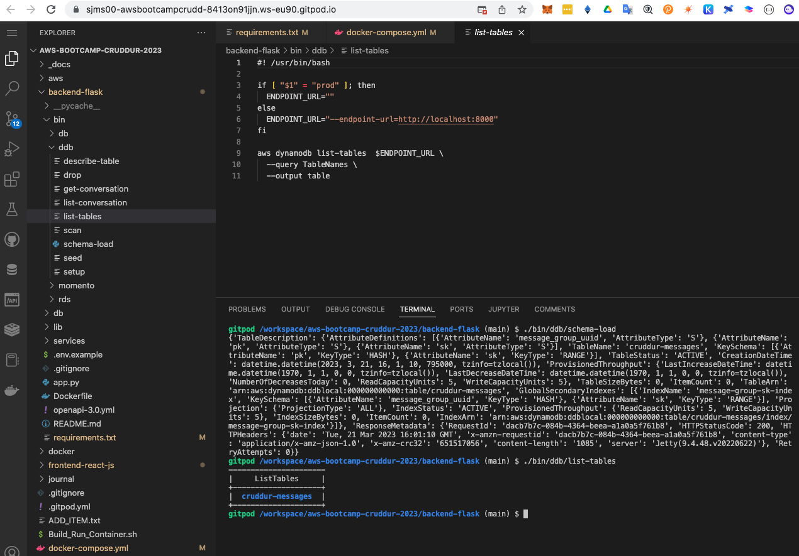 

And seed this table and verify with script scan

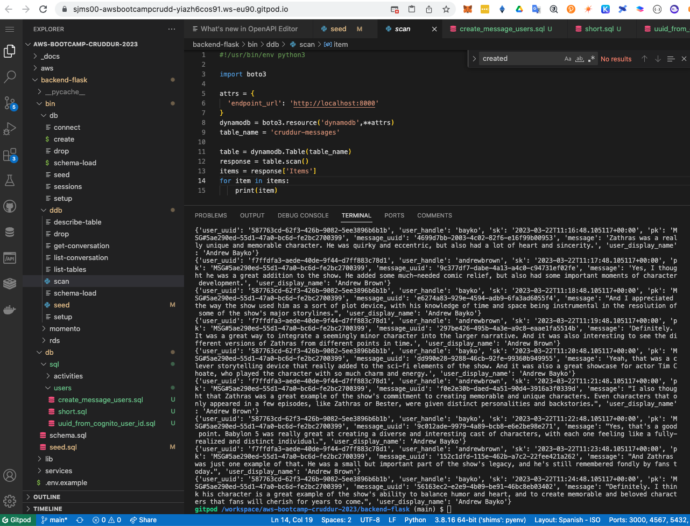

test get_conversation:

with the command:

```sh
./bin/ddb/patterns/get_conversation
```

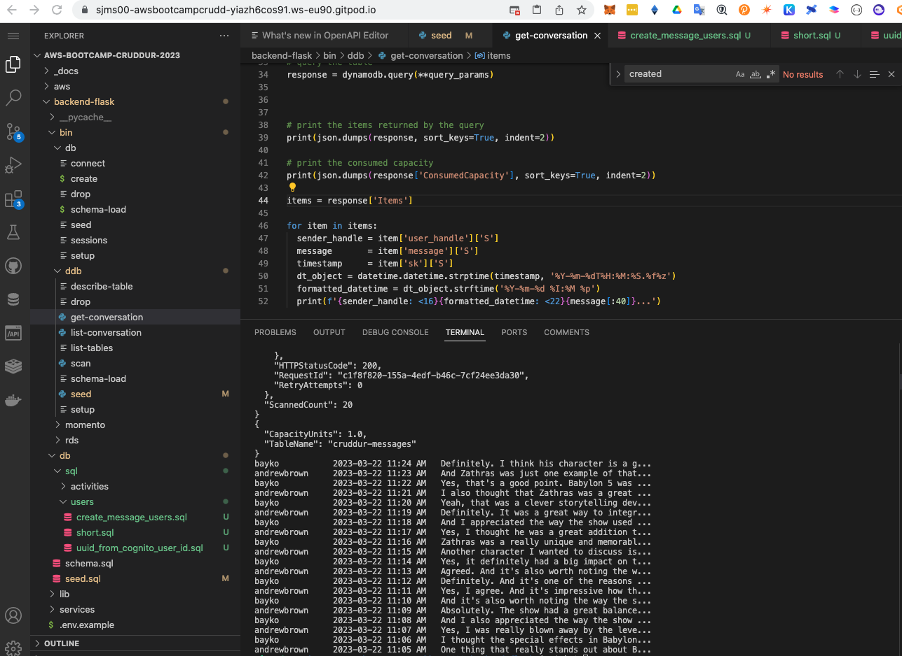

test list_conversation:

with the command:

```sh
./bin/ddb/patterns/list_conversation
```

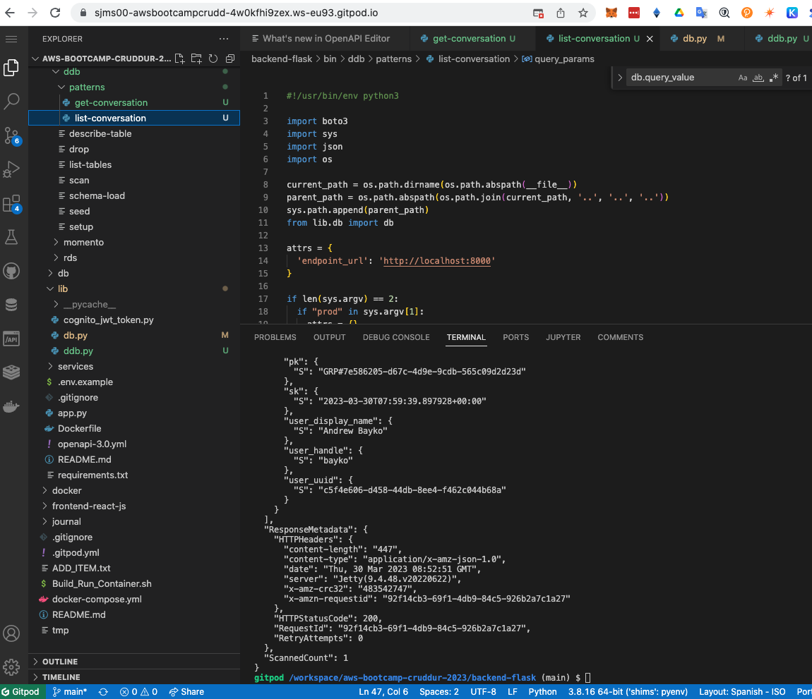

## Implement Update Cognito ID Script for Postgres Database

we create the script ./bin/db/update_cognito_user_ids to update Cognito ID Script for Postgres Database

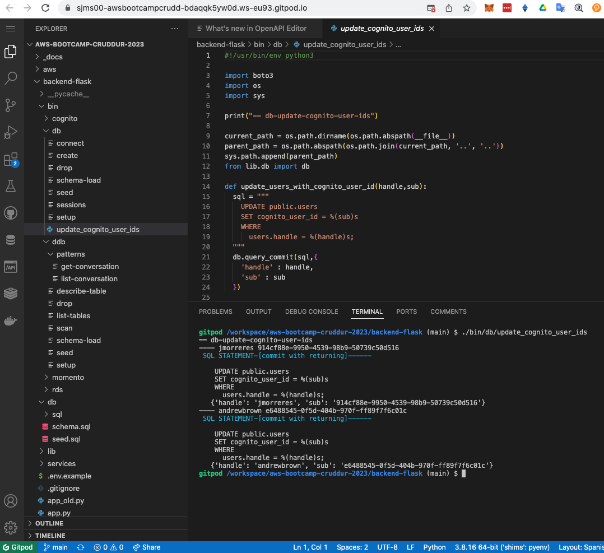

Modify diferents modules .js to eliminate the coockies and add the current user id


## The Boundaries of DynamoDB

- When you write a query you have provide a Primary Key (equality) eg. pk = 'andrew'
- Are you allowed to "update" the Hash and Range?
  - No, whenever you change a key (simple or composite) eg. pk or sk you have to create a new item.
    - you have to delete the old one
- Key condition expressions for query only for RANGE, HASH is only equality 
- Don't create UUID for entity if you don't have an access pattern for it


3 Access Patterns

## Pattern A  (showing a single conversation)

A user wants to see a list of messages that belong to a message group
The messages must be ordered by the created_at timestamp from newest to oldest (DESC)

```sql
SELECT
  messages.uuid,
  messages.display_name,
  messages.message,
  messages.handle,
  messages.created_at -- sk
FROM messages
WHERE
  messages.message_group_uuid = {{message_group_uuid}} -- pk
ORDER BY messages.created_at DESC
```

And test to see the messages of the conversation:

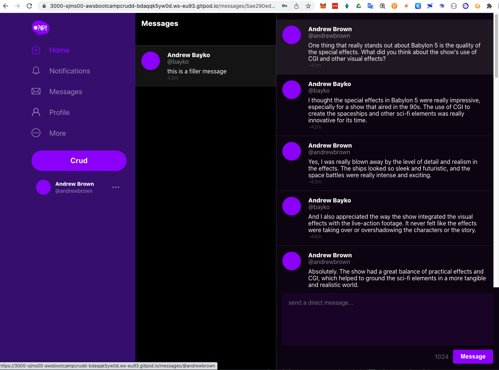

> message_group_uuid comes from Pattern B

## Pattern B (list of conversation)

A user wants to see a list of previous conversations.
These conversations are listed from newest to oldest (DESC)
We want to see the other person we are talking to.
We want to see the last message (from whomever) in summary.

```sql
SELECT
  message_groups.uuid,
  message_groups.other_user_uuid,
  message_groups.other_user_display_name,
  message_groups.other_user_handle,
  message_groups.last_message,
  message_groups.last_message_at
FROM message_groups
WHERE
  message_groups.user_uuid = {{user_uuid}} --pk
ORDER BY message_groups.last_message_at DESC
```

> We need a Global Secondary Index (GSI)
> And add a new message in the conversation:


## Pattern C (create a message)

```sql
INSERT INTO messages (
  user_uuid,
  display_name,
  handle,
  creaed_at
)
VALUES (
  {{user_uuid}},
  {{display_name}},
  {{handle}},
  {{created_at}}
);
```

And add a new message in the conversation:

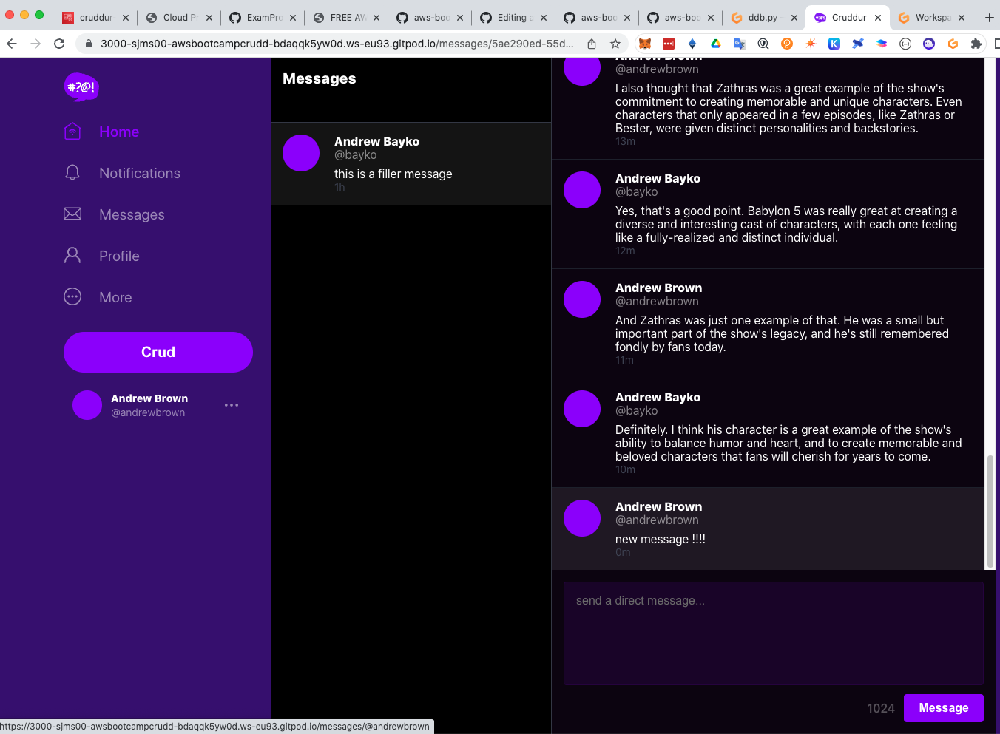

Test a new conversation

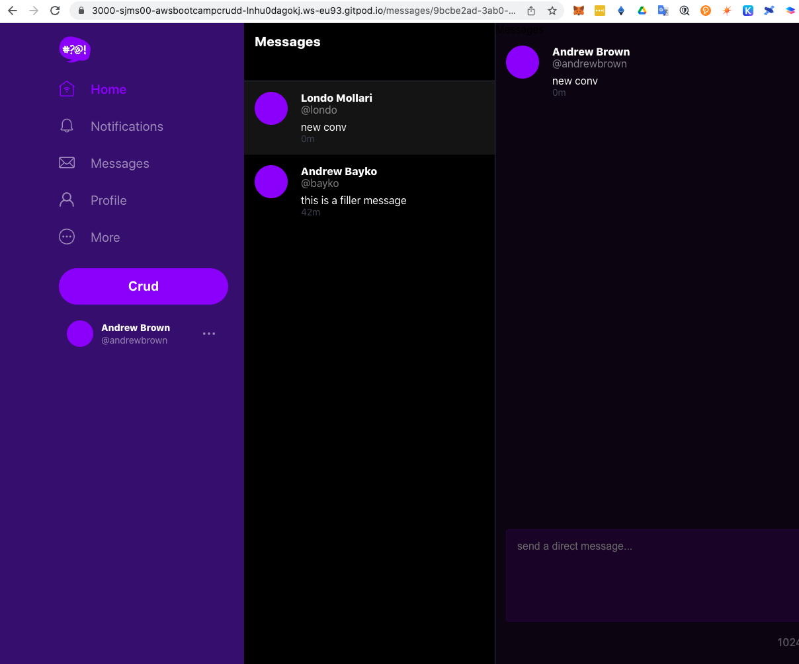

## Pattern D (update a message_group for the last message)

When a user creates a message we need to update the conversation
to display the last message information for the conversation

```sql
UPDATE message_groups
SET 
  other_user_uuid = {{other_user_uuid}}
  other_user_display_name = {{other_user_display_name}}
  other_user_handle = {{other_user_handle}}
  last_message = {{last_message}}
  last_message_at = {{last_message_at}}
WHERE 
  message_groups.uuid = {{message_group_uuid}}
  AND message_groups.user_uuid = {{user_uuid}}
```

Test a new conversation


## Serverless Caching


Create and seed DynamoDB prod table

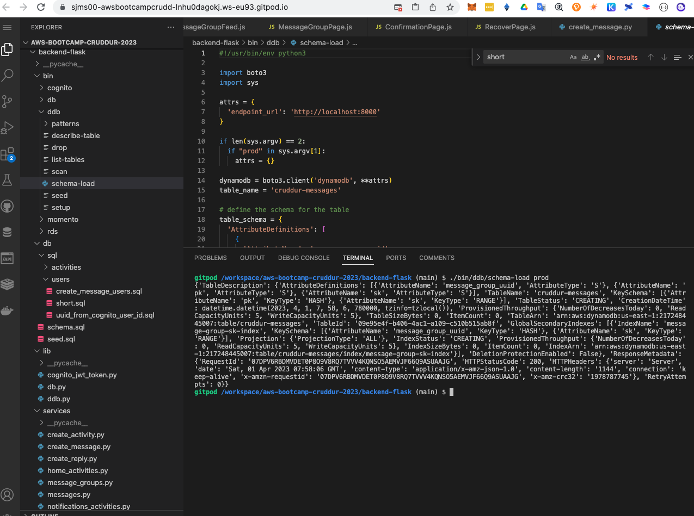


### Install Momento CLI tool

In your gitpod.yml file add:

```yml
  - name: momento
    before: |
      brew tap momentohq/tap
      brew install momento-cli
```

### Login to Momento

There is no `login` you just have to generate an access token and not lose it. 
 
You cannot rotate out your access token on an existing cache.

If you lost your cache or your cache was comprised you just have to wait for the TTL to expire.

> It might be possible to rotate out the key by specifcing the same cache name and email.

 ```sh
 momento account signup aws --email andrew@exampro.co --region us-east-1
 ```

### Create Cache

```sh
export MOMENTO_AUTH_TOKEN=""
export MOMENTO_TTL_SECONDS="600"
export MOMENTO_CACHE_NAME="cruddur"
gp env MOMENTO_AUTH_TOKEN=""
gp env MOMENTO_TTL_SECONDS="600"
gp env MOMENTO_CACHE_NAME="cruddur"
```

> you might need to do `momento configure` since it might not pick up the env var in the CLI.

Create the cache:

```sh
momento cache create --name cruddur
```


### DynamoDB Stream trigger to update message groups

- create a VPC endpoint for dynamoDB service on your VPC
- create a Python lambda function in your vpc
- enable streams on the table with 'new image' attributes included
- add your function as a trigger on the stream
- grant the lambda IAM role permission to read the DynamoDB stream events

`AWSLambdaInvocation-DynamoDB`

- grant the lambda IAM role permission to update table items


Create a VPC Endpoint:

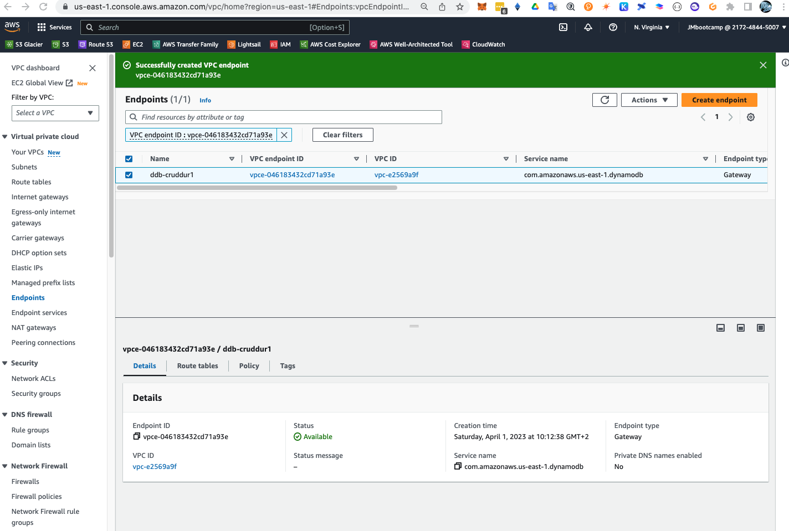

**The Function**

```.py
import json
import boto3
from boto3.dynamodb.conditions import Key, Attr

dynamodb = boto3.resource(
 'dynamodb',
 region_name='us-east-1',
 endpoint_url="http://dynamodb.us-east-1.amazonaws.com"
)

def lambda_handler(event, context):
  pk = event['Records'][0]['dynamodb']['Keys']['pk']['S']
  sk = event['Records'][0]['dynamodb']['Keys']['sk']['S']
  if pk.startswith('MSG#'):
    group_uuid = pk.replace("MSG#","")
    message = event['Records'][0]['dynamodb']['NewImage']['message']['S']
    print("GRUP ===>",group_uuid,message)
    
    table_name = 'cruddur-messages'
    index_name = 'message-group-sk-index'
    table = dynamodb.Table(table_name)
    data = table.query(
      IndexName=index_name,
      KeyConditionExpression=Key('message_group_uuid').eq(group_uuid)
    )
    print("RESP ===>",data['Items'])
    
    # recreate the message group rows with new SK value
    for i in data['Items']:
      delete_item = table.delete_item(Key={'pk': i['pk'], 'sk': i['sk']})
      print("DELETE ===>",delete_item)
      
      response = table.put_item(
        Item={
          'pk': i['pk'],
          'sk': sk,
          'message_group_uuid':i['message_group_uuid'],
          'message':message,
          'user_display_name': i['user_display_name'],
          'user_handle': i['user_handle'],
          'user_uuid': i['user_uuid']
        }
      )
      print("CREATE ===>",response)
```
After create the VPC, DynamoDB table and lambda function in AWS, we test to create a new message:

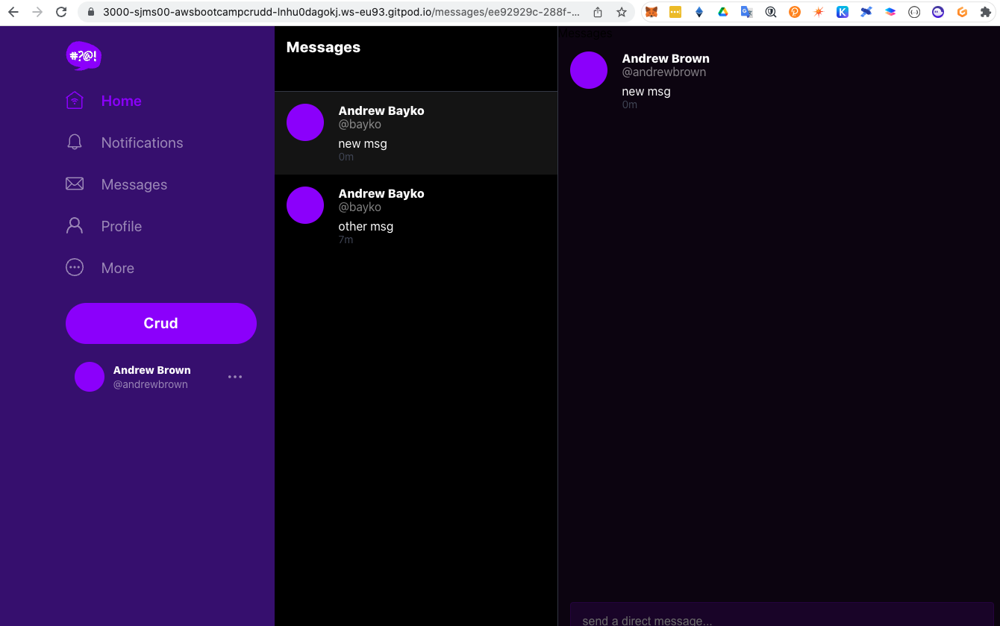

Don't have any errors:

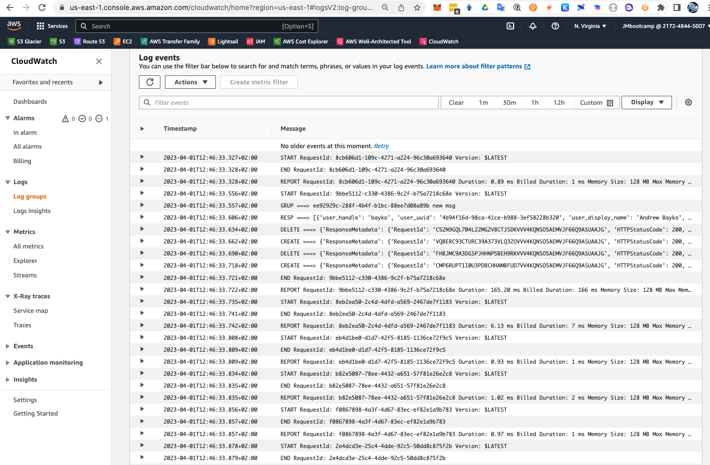

And we can see the recors in the prod table:

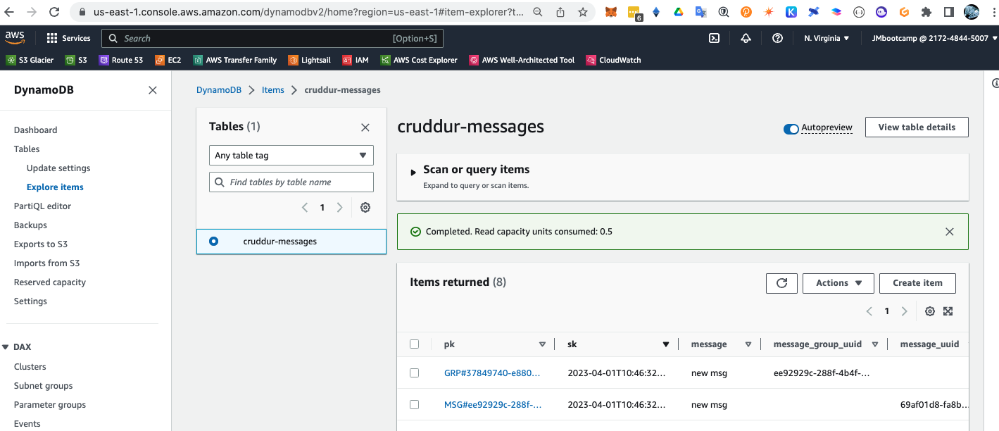

